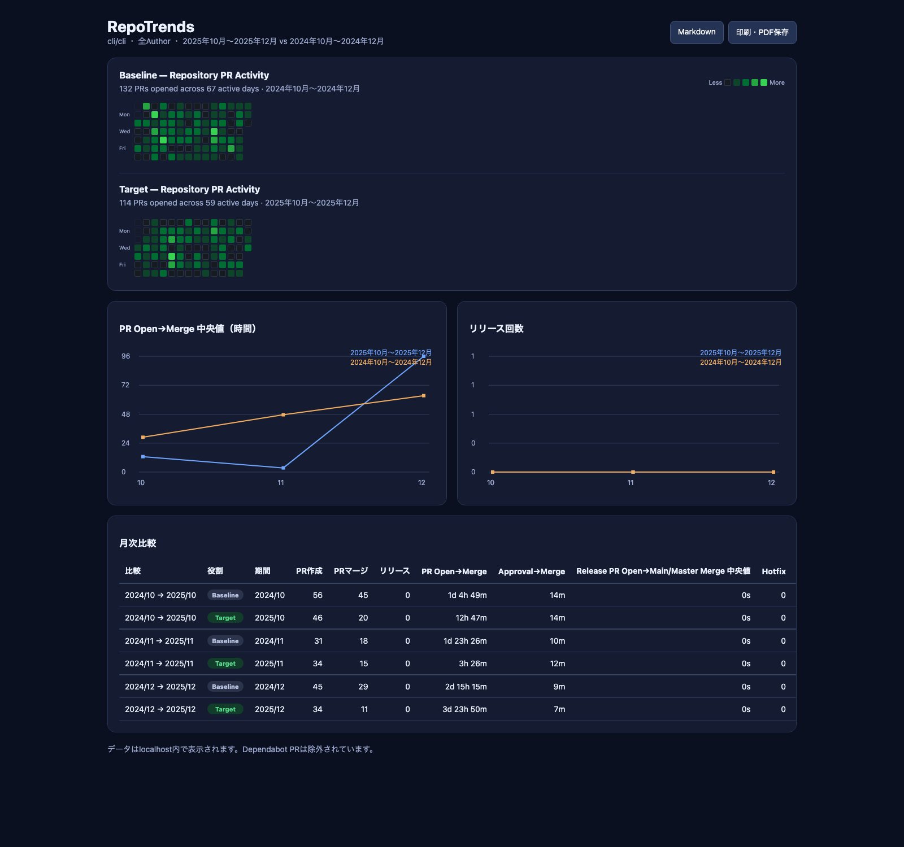

# RepoTrends 🎯

**RepoTrends** is a GitHub CLI extension that helps teams understand their current development flow and how it changes over time through PR metrics, lead times, release cadence, code review patterns, and CI/CD performance.

## ✨ Features

- **📊 Pull Request Analytics**: Lead time (avg/median), review time, merge wait, approval→merge
- **🚀 Release Cadence**: Counts merges into `main/master` as releases (Dependabot excluded)
- **💬 Code Review Insights**: Review comments + approvals are counted for coverage/quality
- **🟩 PR Activity Heatmap**: GitHub-style daily activity for one author or the whole repository
- **🚀 CI/CD Performance**: GitHub Actions workflow analysis
- **🌐 Bilingual Output**: `--lang en|jp` / `--jp` for Japanese output
- **⚡ Fast & Efficient**: Parallel fetching, chunked date ranges, smart sampling

## 🚀 Quick Start

```bash
# Interactive mode (recommended)
gh trends

# Analyze specific repository
gh trends --repo owner/repo --since 2024-01-01 --until 2024-12-31

# Japanese output
gh trends --repo owner/repo --since 2024-01-01 --until 2024-12-31 --jp

# Analyze GitHub Actions
gh trends actions --repo owner/repo --since 2024-01-01
```

## 📦 Installation

### Install with GitHub CLI

```bash
gh extension install hironeko/gh-trends
```

Run it with:

```bash
gh trends --help
```

Upgrade or remove the extension:

```bash
gh extension upgrade trends
gh extension remove trends
```

#### Build from Source

```bash
git clone https://github.com/hironeko/gh-trends.git
cd gh-trends
make install
```

## 📋 Prerequisites

- [GitHub CLI (`gh`)](https://cli.github.com/)
- Authenticated GitHub CLI session: `gh auth login`
- Go 1.21+ only when building from source

## 📊 Sample Output

```
📊 Pull Request Statistics
===================================================

🔢 Basic Metrics:
| Total PRs                     | 134 |
| Merged PRs                    | 132 |
| Releases (main/master merges) | 120 |
| Merge Rate                    | 98.5% |

⏱️ Timing Metrics:
| METRIC                 | AVERAGE | MEDIAN |
| Lead Time              | 10h28m  | 24m    |
| Review Time            | 2h47m   | -      |
| Merge Wait Time        | 13h41m  | 5h     |
| Approval→Merge Time    | 6h12m   | 2h     |

💬 Code Review Analysis:
| Review Comments per PR | 0.2 | 0.0 | 8 |
| Review Coverage        | 14 PRs (10.4%) |
```

## 🎯 Use Cases

- **Development Teams**: Track team velocity and code review effectiveness
- **Engineering Managers**: Monitor DORA metrics and development health
- **DevOps Engineers**: Analyze CI/CD performance and failure patterns
- **Open Source Maintainers**: Understand contributor patterns and project health

## 🤔 Why RepoTrends?

Unlike other repository analytics tools, RepoTrends:

- **Zero Configuration**: Works out of the box with GitHub CLI
- **Fast Analysis**: Smart sampling for large repositories
- **Practical Metrics**: Focus on actionable insights
- **Local First**: No data sent to external services
- **Developer Friendly**: Built by developers, for developers

## 📖 Commands

### PR Analysis (Default)

```bash
gh trends [flags]
```

**Flags:**
- `--repo string`: Repository in 'owner/repo' format
- `--since string`: Analyze PRs since date (YYYY-MM-DD)
- `--until string`: Analyze PRs until date (YYYY-MM-DD)
- `--author string`: Filter by author username
- `--label string`: Filter by label name
- `--lang string`: `jp` (default) or `en` for English output
- `--jp`: Shortcut for `--lang jp`
- `--year string`: Show a monthly trend for the specified year
- `--compare-year string`: Compare the monthly trend with another year (requires `--year`)

Compare monthly trends between two years:

```bash
gh trends --repo owner/repo --year 2026 --compare-year 2024
```

### Local dashboard

Open a browser dashboard with a live monthly-fetch progress gauge:

```bash
gh trends serve
```

The dashboard includes summary cards, a GitHub-style PR activity heatmap,
lead-time and release charts, and a detailed monthly comparison table.



#### Example: compare a quarter with the same months one year earlier

The screenshot above was generated from the public [`cli/cli`](https://github.com/cli/cli)
repository with this reproducible command:

```bash
gh trends serve \
  --repo cli/cli \
  --year 2025 \
  --month 12 \
  --months 3 \
  --compare-prev-year
```

This view answers a few questions at a glance:

- Did monthly PR volume increase or decrease year over year?
- Did median lead time improve over the same period?
- Was activity steady, or concentrated on a small number of days?
- Did release, hotfix, or revert activity change?

#### Metric definitions

- **PRs Opened** counts PRs whose `createdAt` is in the displayed period.
- **PRs Merged** counts PRs whose `mergedAt` is in the displayed period.
- **PR Open→Merge** is the median time from `createdAt` to `mergedAt` for
  PRs merged in the displayed period.
- **Median Release PR Open→Main/Master Merge** uses the same calculation, but only
  for PRs whose head matches the configured release prefix (default:
  `release/`) and whose base is `main` or `master`.

The release metric starts when the release PR is opened. It is not the time
since the release branch was created, its first commit, deployment, or
production availability.

The heatmap follows GitHub's dark contribution colors. With `--author`, it
shows PRs opened by that account. Without `--author`, it shows repository-wide
PR activity. Color intensity is calculated from daily PR counts. Cross-year
comparisons render one heatmap per period; contiguous same-year comparisons
are merged into one continuous heatmap without double-counting overlapping
months. Summary cards are hidden in comparison mode so that primary-only totals
are not mistaken for comparison results.

With no selection flags, RepoTrends interactively asks for the repository,
year or month mode, target period, comparison method, optional PR author, and
local port. You can also explicitly enable prompts while supplying some values
in advance:

```bash
gh trends serve --interactive --repo owner/repo
```

For non-interactive use, pass the selection flags directly:

```bash
gh trends serve --repo owner/repo --year 2026 --compare-year 2025
```

Analyze and compare by month. `--months N` shows N monthly rows ending at
`--month` (or the current month when `--month` is omitted):

```bash
# One month
gh trends serve --repo owner/repo --year 2026 --month 8

# Same month in the previous year
gh trends serve --repo owner/repo --year 2026 --month 8 --compare-prev-year

# Same month in a specified year
gh trends serve --repo owner/repo --year 2026 --month 8 --compare-year 2024

# Previous month
gh trends serve --repo owner/repo --year 2026 --month 8 --compare-prev-month

# Six monthly rows ending in August 2026
gh trends serve --repo owner/repo --year 2026 --month 8 --months 6

# Six months, with each month compared to the previous month
gh trends serve --repo owner/repo --year 2026 --month 8 --months 6 --compare-prev-month
```

The dashboard binds only to `127.0.0.1` by default. When data collection is
complete, use **Markdown** to download the report or **Print / Save PDF** to
export it from the browser.

```bash
gh trends serve --repo owner/repo --year 2026 --port 9090 --no-open
```

### GitHub Actions Analysis

```bash
gh trends actions [flags]
```

Analyzes CI/CD performance, workflow success rates, and failure patterns.

## 🔧 Advanced Usage

### Large Repositories

RepoTrends automatically optimizes for large repositories using:
- Smart sampling (recent + distributed historical PRs)
- Parallel processing for date ranges
- GraphQL complexity management

### Custom Time Ranges

```bash
# Last quarter analysis
gh trends --since 2024-10-01 --until 2024-12-31

# Specific team member
gh trends --author username --since 2024-01-01

# Feature branch analysis
gh trends --label "feature" --since 2024-06-01
```

## 🤝 Contributing

We welcome contributions! Please see [CONTRIBUTING.md](CONTRIBUTING.md) for guidelines.

## 📄 License

MIT License - see [LICENSE](LICENSE) for details.

## 🙏 Acknowledgments

- Inspired by [peco](https://github.com/peco/peco) for terminal UX
- Built on [GitHub CLI](https://cli.github.com/) for robust GitHub API access
- The GitHub CLI extension structure and distribution approach were informed
  by [gh-pr-graph](https://github.com/orangain/gh-pr-graph), created by
  [@orangain](https://github.com/orangain)
- Thanks to the Go community for excellent CLI libraries

---

**Made with ❤️ for developers who love data-driven insights**
